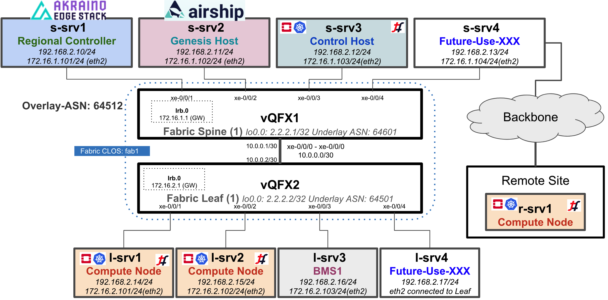

# akraino-nc-tf
Akraino Network Cloud Integration with Tungsten Fabric

This repo is created for functional testing of Akraino Network Cloud blueprint integration with Tungsten Fabric.

***High Level Topology Diagram***
 (1x1 vQFX Spine & Leaf with 8 Nodes)

